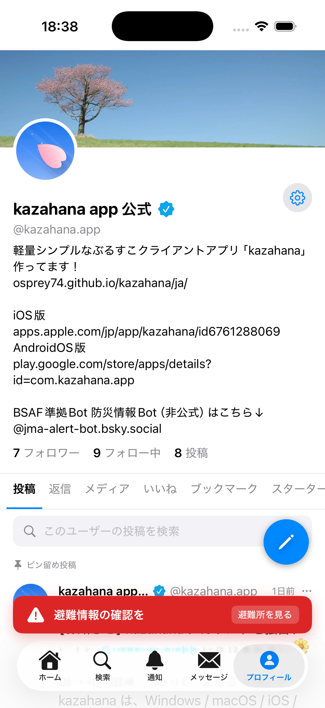
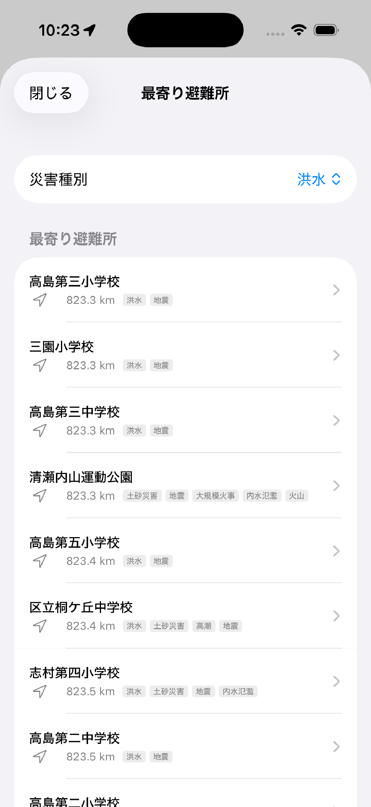
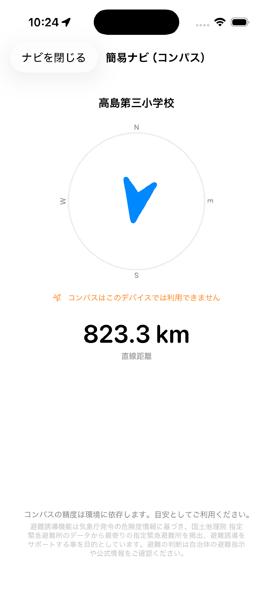
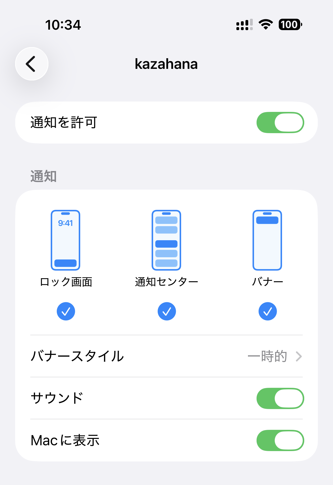
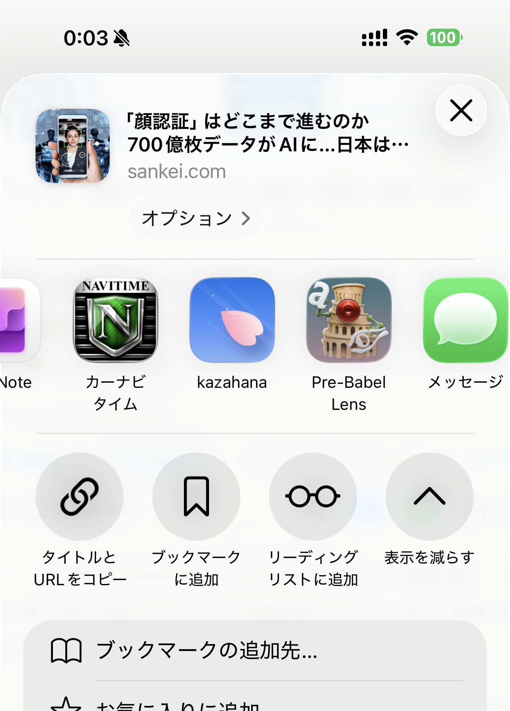
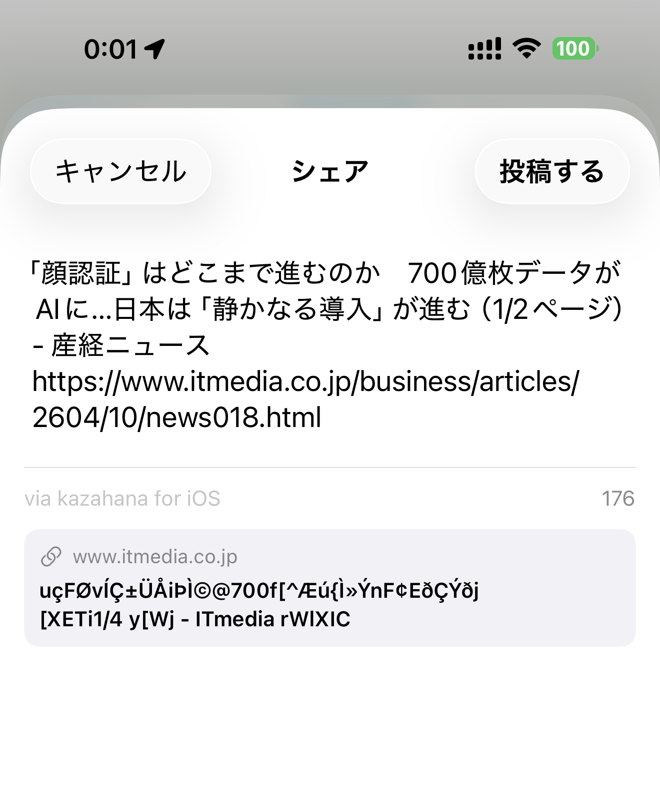
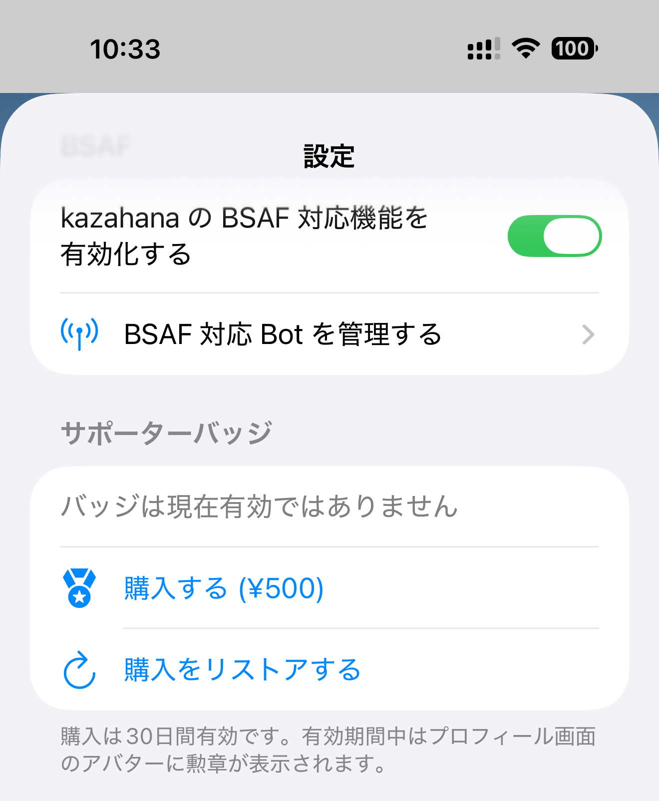

# kazahana iOS 補足ガイド

このガイドでは、iOS 版 kazahana に固有の機能について説明します。全プラットフォーム共通の機能（タイムライン、投稿、検索、通知、DM、プロフィール、設定、BSAF など）については、[デスクトップ版操作マニュアル](https://github.com/osprey74/kazahana/blob/main/docs/ja/guide/index.md)をご覧ください。

---

## 目次

- [避難所ナビ（避難誘導機能）](#避難所ナビ避難誘導機能)
- [プッシュ通知](#プッシュ通知)
- [共有シート（Share Extension）](#共有シートshare-extension)
- [サポーターバッジ（アプリ内課金）](#サポーターバッジアプリ内課金)
- [iOS 固有のナビゲーション](#ios-固有のナビゲーション)
- [ディープリンク](#ディープリンク)
- [デスクトップ版との違い](#デスクトップ版との違い)

---

## 避難所ナビ（避難誘導機能）

v3.2.0 で追加された機能です。気象庁の警報級・危険度情報（bsaf-kikikuru-bot 経由）を検知すると、最寄りの避難所を案内します。避難所データ（国土地理院 指定緊急避難場所データ）はアプリに同梱されており、**通信がない状況でも利用できます**。

> **注意:** 本機能は気象庁の危険度情報に基づく補助であり、自治体の避難指示そのものではありません。避難の判断は自治体の避難指示や公式情報をご確認ください。

### 機能を有効にする

避難所ナビはデフォルトでオフになっています。以下の手順で有効にしてください：

1. **プロフィール** タブ → **設定** アイコンをタップします。
2. **避難誘導** セクションまでスクロールします。
3. **避難誘導機能を有効にする** トグルをオンにします。
4. bsaf-kikikuru-bot が未登録の場合、確認ダイアログが表示されます。**有効化する** をタップすると、bsaf-kikikuru-bot が自動的に BSAF 登録・フォローされます。

必要に応じて **都道府県（手動設定）** で自分の都道府県を選択できます。「自動（位置情報から判定）」のままにすると、位置情報から自動で判定されます。オフライン利用時は手動設定を推奨します。

### 警報バナー

避難誘導機能が有効な状態で、設定した都道府県（または現在地）に該当する気象警報情報を受信すると、画面下部にバナーが表示されます。

- **レベル 3（黄色）**: 警報級の気象情報が出ています
- **レベル 4（赤色）**: 避難情報の確認を
- **レベル 5（ピンク）**: 直ちに安全確保を

バナーの **避難所を見る** をタップすると、最寄り避難所の一覧に遷移します。警報が解除されるか、6時間経過するとバナーは自動的に消えます。

### 最寄り避難所一覧

現在地から近い順に避難所が一覧表示されます。各避難所には直線距離と対応する災害種別（洪水・土砂災害・地震など）がタグで表示されます。

**災害種別** のピッカーで表示する避難所をフィルタできます。受信した警報の種類に応じて、自動的に適切なフィルタが設定されます。

避難所をタップすると詳細画面に遷移し、**地図アプリでナビ**（Apple Maps の徒歩ナビ）または **簡易ナビ（コンパス）** を選択できます。

### 簡易ナビ（コンパス）

通信がなくても使えるコンパスベースのナビゲーションです。端末の磁気センサを利用し、選択した避難所の方向を矢印で、直線距離をリアルタイムで表示します。

- 矢印が示す方向に歩くと距離が減少していきます。
- 磁気センサの精度が低い場合は、端末を8の字に動かしてキャリブレーションしてください。
- オフライン時は Apple Maps のナビが利用できないため、この簡易ナビが主な手段となります。

### オフライン利用

避難所データはアプリに同梱されているため、機内モードでも以下の操作が可能です：

| 操作 | オフライン |
|------|-----------|
| 最寄り避難所一覧の表示 | 可能 |
| 簡易ナビ（コンパス） | 可能 |
| 地図アプリでナビ | 不可（通信が必要） |
| 都道府県の自動判定 | 不可（手動設定が必要） |

> **補足:** 避難所データの出典は国土地理院 指定緊急避難場所データです。最新でない場合があります。最新情報は自治体にご確認ください。

### デモモード（動作確認）

災害情報が発令されていない平常時でも、避難所ナビの動作を確認できます。

1. **設定** 画面を開きます。
2. 画面下部の **バージョン番号を5回タップ** します。
3. 避難誘導セクションにデモ用のボタンが表示されます。
4. デモボタンをタップすると、警報バナーの表示や避難所一覧への遷移を実際に試すことができます。

> **補足:** デモモードで表示されるバナーはテスト用です。実際の気象警報とは関係ありません。

---

## プッシュ通知

iOS 版 kazahana は、Apple Push Notification service（APNs）を通じたプッシュ通知に対応しています。[kazahana-push-backend](https://github.com/osprey74/kazahana-push-backend) と連携して動作します。

### プッシュ通知を有効にする

初回ログイン時に、iOS の通知許可ダイアログが表示されます。**許可** をタップしてプッシュ通知を有効にしてください。

ダイアログを閉じてしまった場合や、拒否した場合は、以下の手順で有効化できます：

1. iOS の **設定** アプリを開きます。
2. 下にスクロールして **kazahana** をタップします。
3. **通知** をタップします。
4. **通知を許可** をオンにします。

> **補足:** アプリ内にプッシュ通知のオン/オフ設定はありません。iOS の設定アプリで管理します。

### 仕組み

- プッシュ通知を有効にすると、デバイストークンが kazahana プッシュ通知サーバーに自動登録されます。
- いいね、返信、リポスト、フォロー、メンション、DM などのアクティビティが通知されます。
- 複数のアカウントを登録している場合、すべてのアカウントに対してプッシュ通知が登録されます。

### バッジカウント

- アプリアイコンのバッジに未読通知数が表示されます。
- アプリを開くとバッジは自動的にクリアされます。
- バックグラウンド更新により、約15分間隔（iOS が管理）で未読通知数がチェックされます。

### ログアウト時

ログアウトまたはアカウントを削除すると、そのアカウントのデバイストークンがプッシュ通知サーバーから自動的に解除されます。

---

## 共有シート（Share Extension）

他のアプリ（Safari、写真など）から直接 kazahana にコンテンツを共有できます。

### 共有の方法

1. 任意のアプリで **共有** ボタン（↑ アイコン）をタップします。
2. 共有シートから **kazahana** を選択します。

   

3. kazahana の共有作成画面が開き、共有コンテンツが自動入力されます。

   

4. 必要に応じてテキストを編集し、**投稿する** をタップします。

### 共有できるコンテンツ

| コンテンツの種類 | 動作 |
|------------------|------|
| **URL** | ページタイトルと URL が入力されます。OGP リンクカード（サムネイル・タイトル・説明文）が自動生成されます。 |
| **テキスト** | テキストがそのまま入力されます。 |
| **画像** | 最大4枚まで添付できます。画像は自動圧縮されます（最大950KB、最大2048px）。 |
| **テキスト + URL + 画像** | すべてを組み合わせて共有できます。画像がある場合、リンクカードは添付されません（Bluesky の仕様）。 |

### 制限事項

- 1投稿あたり最大300文字です。
- 画像は最大4枚までです。
- 共有機能を使用するには、kazahana アプリにログインしている必要があります。
- 投稿言語は kazahana の言語設定に従います。

---

## サポーターバッジ（アプリ内課金）

kazahana プロジェクトへのサポートを表示するサポーターバッジです。

### バッジの効果

有効期間中、アプリ内のプロフィールでアバターにゴールドメダルアイコンが表示されます。

### 購入方法

1. **設定** を開きます（プロフィールタブ → 設定アイコン）。
2. **サポーターバッジ** セクションまでスクロールします。
3. 現在のステータスが表示されます：「無効」または「○年○月○日まで有効」。
4. **購入** ボタンをタップします（お住まいの地域の通貨で価格が表示されます）。

5. Face ID / Touch ID / Apple ID パスワードで認証します。
6. バッジが即座に有効になります。

### 有効期間と更新

- サポーターバッジの有効期間は購入日から **30日間** です。
- 期限切れ後もバッジを表示し続けるには、再度購入してください。

### 購入の復元

以前別のデバイスで購入した場合や、アプリを再インストールした場合は、**購入を復元** をタップして有効なバッジを復元できます。

---

## iOS 固有のナビゲーション

### タブバー

タブバーは画面 **下部** に配置され、5つのタブがあります：ホーム、検索、通知、メッセージ、プロフィール。

- **ホームタブを再タップ** すると、タイムラインが先頭にスクロールされます。
- メッセージタブに未読 DM 数がバッジで表示されます。

### ジェスチャー

| ジェスチャー | 操作 |
|------------|------|
| **画面左端からスワイプ** | 前の画面に戻る |
| **アカウントを左にスワイプ** | アカウントを削除（設定画面） |

---

## ディープリンク

iOS 版 kazahana は `kazahana://` および `https://bsky.app` の URL に対応しています。

| URL パターン | 動作 |
|-------------|------|
| `kazahana://profile/{ハンドル}` | ユーザーのプロフィールを表示 |
| `kazahana://post/{AT URI}` | 投稿スレッドを表示 |
| `kazahana://hashtag/{タグ}` | ハッシュタグを検索 |
| `kazahana://compose?text=...` | テキストを入力した状態で投稿画面を表示 |

---

## デスクトップ版との違い

### iOS のみの機能

| 機能 | 説明 |
|------|------|
| 避難所ナビ | 気象警報時に最寄り避難所を案内（オフライン対応） |
| プッシュ通知 | APNs によるリアルタイム通知 |
| 共有シート | 他のアプリから kazahana への共有 |
| サポーターバッジ | アプリ内課金によるサポーター表示 |
| バックグラウンド更新 | アプリがバックグラウンドでも通知を定期チェック |

### iOS で利用できないデスクトップ機能

| 機能 | 理由 |
|------|------|
| ブックマークレット | iOS にはブラウザのブックマークバーがないため |
| OS 起動時の自動起動 | iOS では非対応 |
| システムトレイへの最小化 | iOS にはシステムトレイがないため |
| ウィンドウ管理 | iOS アプリは全画面表示 |
